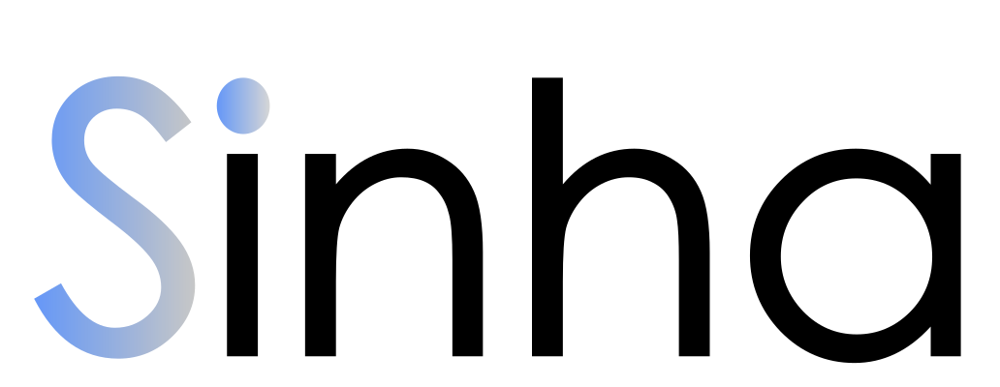

  

  <em>Infinite Connections.</em>

---

## Hi, we are Sinha

Welcome to our repository. This is where we share our work, experiments, and projects that are part of the Sinha ecosystem.  
Each repository is a piece of our journey to build **connected technologies** that are simple, powerful, and designed for the future.

---

## What is Sinha?

Sinha is a company that represents an ecosystem of ideas, tools, and technologies designed to connect people, code, and creativity.  
From operating systems to programming languages, we focus on building systems that empower developers and simplify innovation.

---

## What We Do

- **Connectivity**  
  Designing products that seamlessly connect with each other, making technology feel natural and powerful.

- **Programming Languages**  
  Creator of [Sling]("https://github.com/Open-Sling/Sling/"), a dynamic, embeddable, open-source programming language for everything from microcontrollers to full-stack systems.

- **Operating Systems**  
  Building Nebula OS and devices like Nebula Arc, Nebula Circle, and Nebula Aura to push the boundaries of AI and Personal Embedded Systems (PESs).
- **Innovation**  
  Every project is built with one philosophy: *the more we code, the more you can do.*

---

## Our Vision

To create an ecosystem where hardware, software, and people are linked through infinite connections.  
We’re not just building tools — we’re building the future of connected computing.
